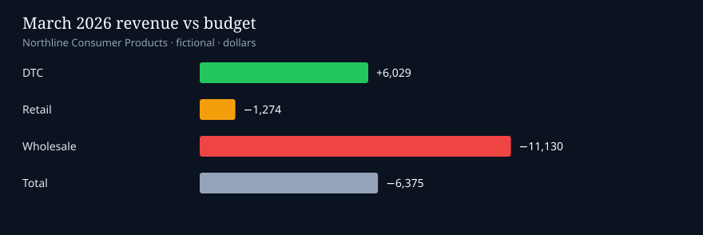

# Northline SQL variance pack

Monthly FP&A flash in SQL. Actual vs budget vs forecast, price/volume, channel margin, and OpEx by cost center.

Fictional company: **Northline Consumer Products**. No employer data.

The question this answers: March revenue missed budget by about $6k. Was that price, volume, or mix, and did OpEx make it worse?

## What the queries show (March 2026)

| Item | Result |
| --- | ---: |
| Revenue | $623k |
| vs budget | −$6.4k (−1.0%) |
| Gross margin | 57.2% |
| OpEx vs budget | +$3.9k |
| Contribution after OpEx | $185k |

Channel split for March: DTC beat budget by $6.0k on hydration price and volume. Wholesale missed by $11.1k, almost all snacks volume. Marketing is the YTD OpEx problem (+9% vs budget, media).

## Run it

```bash
pip install -r requirements.txt
python load_and_run.py
```

That loads `data/` into SQLite and writes one CSV per query under `output/`.

## Queries

| File | Use |
| --- | --- |
| `sql/01_monthly_variance.sql` | Revenue and margin vs budget and forecast |
| `sql/02_price_volume.sql` | Price and volume variance by SKU, latest actual month |
| `sql/03_channel_margin.sql` | Channel revenue and gross margin |
| `sql/04_opex_by_cost_center.sql` | YTD OpEx vs budget |
| `sql/05_executive_flash.sql` | One-row close flash |

Stack: SQL (SQLite) · pandas. Same grain an FP&A analyst would pull from a warehouse.


